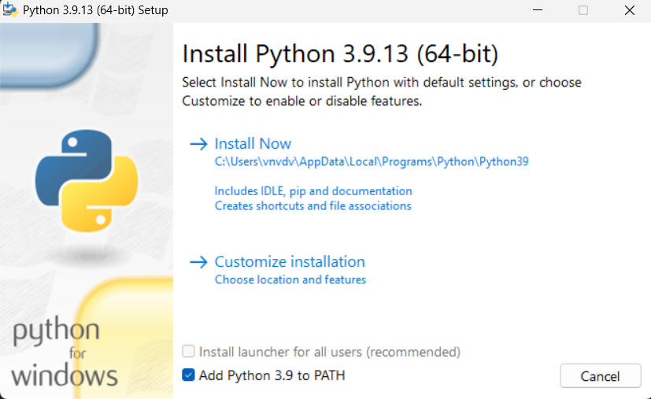
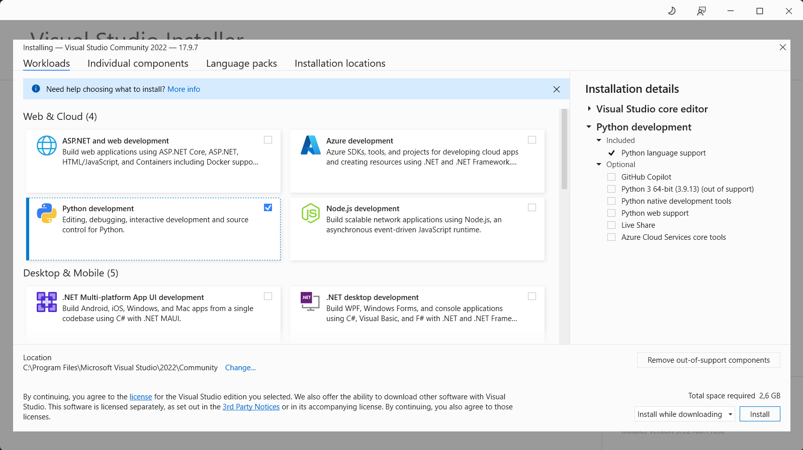
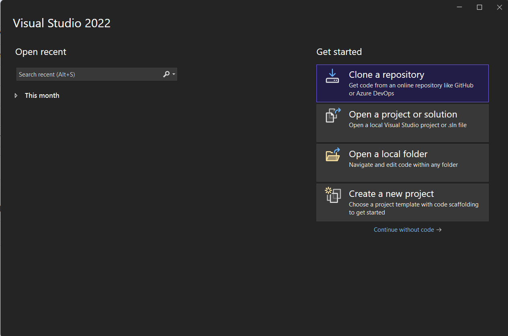
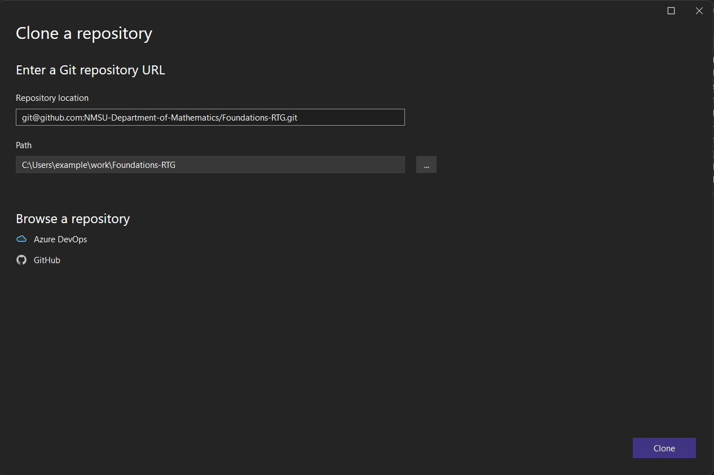
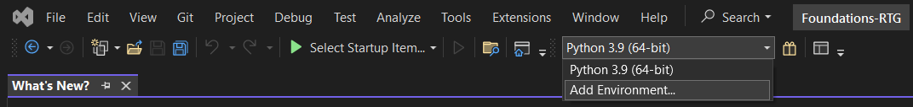
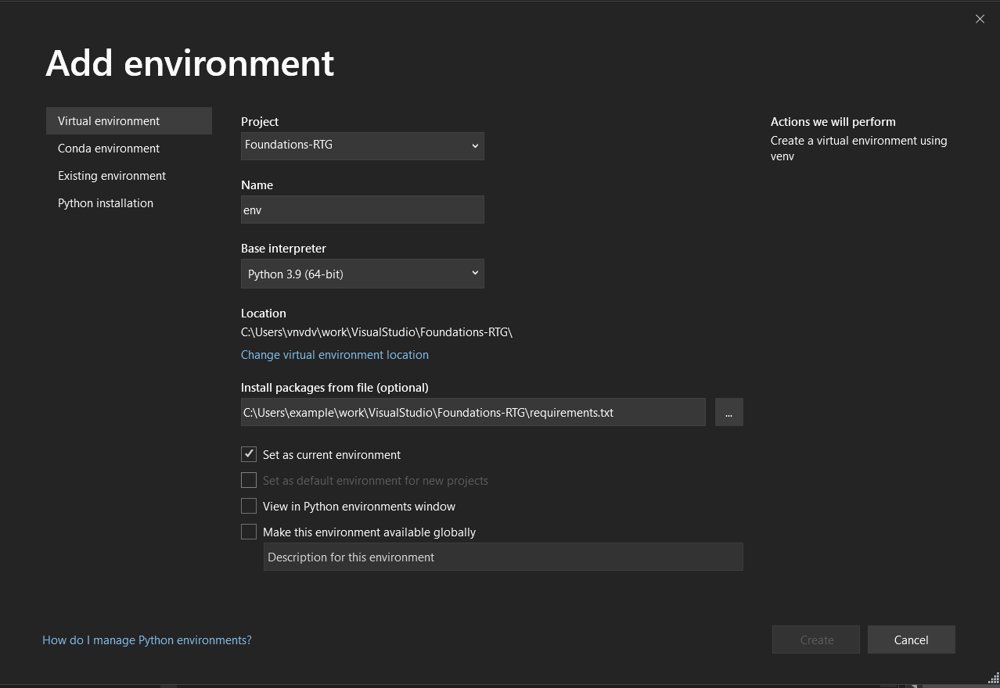
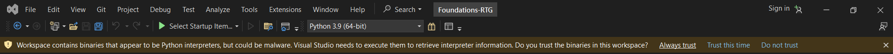
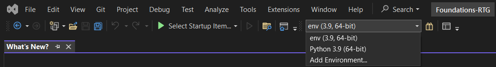
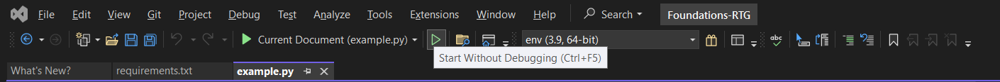
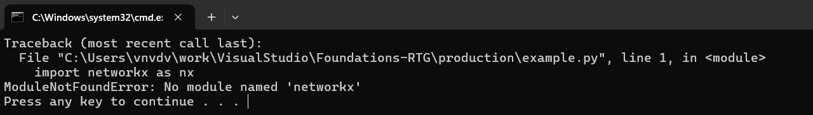

# Quick Start Guide
## Install Python 3.9
1. Download the Python 3.9 installer from https://www.python.org/downloads/release/python-3913/.
2. Check "Add Python 3.9 to PATH". Click "Install Now". 

> [!CAUTION]
> There are known compatibility issues with the Python libraries that we use in this project. If you have an installation of any version of Python other than 3.9, we strongly recommend installing Python 3.9 in parallel. In Visual Studio you will be able to choose the version of Python to run the code.

## Install Visual Studio Community

We recommend to use Visual Studio Community for viewing, editing, running and debugging the project code. This free IDE provides easy access to all of these features, as well as GitHub integration.

1. Download the installer from https://visualstudio.microsoft.com/ru/vs/community/.
2. Run `VisualStudioSetup.exe`.
3. Select "Python development". Don't check any boxes in "Installation details". Click the "Install" button. 
4. Wait until Visual Studio is installed. After the setup, Visual Studio will launch automatically.
5. You may skip the sign-in screen. In the startup menu, select "General" for "Development settings".

## Clone the project from GitHub

1. Run Visual Studio Community.
2. Click "Clone a repository". 
3. Enter the link: `git@github.com:NMSU-Department-of-Mathematics/Foundations-RTG.git`. You may also choose a path on your computer where the folder with the project is created. Click "Clone". 
4. The project will open in a new window.

## Set up a virtual environment.
1. Click the dropdown on the top panel. Select "Add Environment..." 
2. Make sure that the full path to `requirements.txt` is entered in the field "Install packages from file (optional)". If not, find it in the project root folder. Click "Create". 
3. Check for a popup about Python executables in the top of the window. Click "Always Trust". 
4. Our new virtual environment must appear in the dropdown on the top panel. Select the new environment. 

## Run the example code.
1. In "Solution Explorer" find the file `production/example.py`.
2. Click the run button on the top panel. 
3. A tab with a 3D graph should open in your browser.

> [!IMPORTANT]
> There is a known issue with Python Environments in Visual Studio. It may not install the dependencies properly on the first run. If you see a window with an error message like "ModuleNotFoundError: No module named 'networkx'", repeat the steps from section ["Set up a virtual environment"](https://github.com/NMSU-Department-of-Mathematics/Foundations-RTG/blob/main/README.md#set-up-a-virtual-environment). You might need to enter a different environment name. 