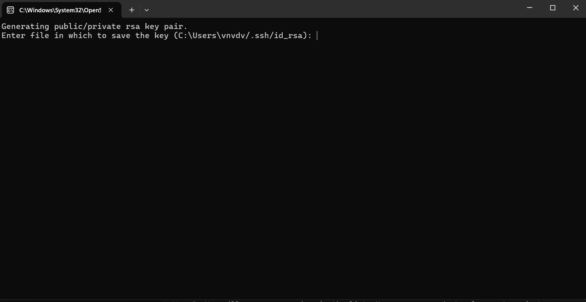

# Quick Start Guide
## Install Python 3.9
1. Open https://www.python.org/downloads/release/python-3913/. Scroll down to "Files" and click the download link that corresponds to your operating system. If you are using Windows, most likely it will be "Windows installer (64-bit)" 
2. Check "Add Python 3.9 to PATH". Click "Install Now". 

> [!CAUTION]
> There are known compatibility issues with Python libraries. If you have an installation of any version of Python other than 3.9, we strongly recommend installing Python 3.9 in parallel. In Visual Studio you will be able to choose the version of Python to run the code.

## Install Visual Studio Community

We recommend to use Visual Studio Community for viewing, editing, running and debugging the project code. This free IDE provides easy access to all of these features, as well as GitHub integration.

1. Download the installer from https://visualstudio.microsoft.com/ru/vs/community/.
2. Run `VisualStudioSetup.exe`.
3. Select "Python development". Don't check any boxes in "Installation details". Click the "Install" button. 
4. Wait until Visual Studio is installed. After the setup, Visual Studio will launch automatically.
5. You may skip the sign-in screen. In the startup menu, select "General" for "Development settings".

## Add an access key in your GitHub account

1. Open GitHub and click on the top right round icon. In the menu, open "Settings". 
2. In Settings, open "SSH and GPG keys". Check if you already have an SSH key for the computer that you are working on now. If you have already cloned any GitHub projects on this computer, most likely you have an SSH key. If you have an SSH key, go to the next section. Otherwise, you will need to create it. 
3. To create a key, click the "New SSH Key" button.
4. Generate an SSH key using the `ssh-keygen` command. On Windows, press `Win+R` and type `ssh-keygen` in the window (you can just copy the command from here). Click "OK". 
5. You will see a window like this: 
Copy the path to the id_rsa file. For example, on the screenshot it is `C:\Users\vnvdv/.ssh`. Most likely, the path will be `C:\Users\<login of your Windows account>/.ssh`. You don't need the part after the last slash. Press Enter several times until the window closes.
6. Open the folder with the path that you copied on the previous step. It will contain several files. We need `id_rsa.pub`. 
7. Open `id_rsa.pub` using Notepad or any plain text editor.  It will contain a sequence of letters and numbers starting with `ssh-rsa`. Copy all text from this file. 
8. Insert the text from `id_rsa.pub` into the "Key" field on the GitHub page that you opened. Write any name for the key. Click "Add SSH key". 
9. You will see your new key in the list. Now you are ready to clone out project.

## Clone the project from GitHub

1. Run Visual Studio Community.
2. Click "Clone a repository". 
3. Enter the link: `git@github.com:RTG-Foundations/Foundations-RTG-2024.git`. You may also choose a path on your computer where the folder with the project is created. Click "Clone". 
4. The project will open in a new window.

## Set up a virtual environment.
1. Click the dropdown on the top panel. Select "Add Environment..." 
2. Make sure that the full path to `requirements.txt` is entered in the field "Install packages from file (optional)". If not, find it in the project root folder. Click "Create". 
3. Check for a popup about Python executables in the top of the window. Click "Always Trust". 
4. Our new virtual environment must appear in the dropdown on the top panel. Select the new environment. 

## Run the example code.
1. In "Solution Explorer" find the file `production/example.py`.
2. Click the run button on the top panel. 
3. A tab with a 3D graph should open in your browser.

> [!IMPORTANT]
> There is a known issue with Python Environments in Visual Studio. It may not install the dependencies properly on the first run. If you see a window with an error message like "ModuleNotFoundError: No module named 'networkx'", repeat the steps from section ["Set up a virtual environment"](https://github.com/NMSU-Department-of-Mathematics/Foundations-RTG/blob/main/README.md#set-up-a-virtual-environment). You might need to enter a different environment name. 
